# Bluestock Mutual Fund Analytics Platform

<p align="center">
  
</p>

<p align="center">
  
  
  
  
  
</p>

> **7-day analytics capstone** — End-to-end mutual fund analytics platform covering ETL, EDA, performance metrics, risk analytics, dashboard, Monte Carlo simulation, Markowitz portfolio optimisation, and final reporting for the Indian mutual fund industry (2022–2025).

---

## 📋 Project Overview

| | |
|---|---|
| **Industry** | Indian Mutual Funds (AMFI/SEBI regulated) |
| **Dataset** | 10 CSV files · 40 schemes · 64,320 NAV rows · 32,778 transactions |
| **Period** | January 2022 – December 2025 |
| **Database** | SQLite star schema (12 tables) |
| **Metrics** | 12+ risk-adjusted metrics per fund |
| **Deliverables** | D1–D7 complete + 5 bonus challenges |

### Key Numbers

| Metric | Value |
|--------|-------|
| Total Industry AUM | ₹81 Lakh Crore (Dec 2025) |
| SBI MF AUM | ₹12.50 Lakh Crore (largest AMC) |
| Peak SIP Inflow | ₹31,002 Crore (Dec 2025 — all-time high) |
| Total Folios | 26.12 Crore |
| Best Composite Score | 85.12 — ICICI Pru Midcap |
| Best Sharpe Ratio | 1.07 — Mirae Asset Large Cap |
| SIP Growth (4yr) | +181% (₹11,035 Cr → ₹31,002 Cr) |

---

## 🏗️ System Architecture

```
┌─────────────────────────────────────────────────────────────────────┐
│                   BLUESTOCK MF ANALYTICS PIPELINE                   │
└─────────────────────────────────────────────────────────────────────┘

LAYER 1: DATA SOURCES (Extract)
───────────────────────────────
  📁 10 CSV Datasets          🌐 mfapi.in REST API
  (AMFI Historical Data)      (Live NAV — 6 schemes)
         │                            │
         └──────────────┬─────────────┘
                        ▼
LAYER 2: ETL PIPELINE (Transform)
──────────────────────────────────
  scripts/etl_pipeline.py
  ┌──────────────────────────────────────────────┐
  │  Parse dates → Validate → Forward-fill NAV   │
  │  Dedup → Type-cast → Merge fund metadata     │
  │  Compute daily returns → Create dim tables   │
  └──────────────────────────────────────────────┘
         │
         ▼
LAYER 3: DATA STORAGE (Load)
──────────────────────────────
  data/db/bluestock_mf.db  (SQLite)
  ┌─────────────┐  ┌─────────────┐
  │  dim_fund   │  │  dim_date   │
  │  (40 rows)  │  │ (1,608 rows)│
  └──────┬──────┘  └──────┬──────┘
         │                │
  ┌──────▼────────────────▼──────┐
  │         FACT TABLES          │
  │  fact_nav          64,320    │
  │  fact_transactions 32,778    │
  │  fact_performance      40    │
  │  fact_portfolio       322    │
  │  fact_aum              90    │
  │  fact_sip_industry     48    │
  │  fact_category_inflows 144   │
  │  fact_benchmark      8,050   │
  └──────────────────────────────┘
         │
         ▼
LAYER 4: ANALYTICS (Analyse)
──────────────────────────────
  📓 03_eda_analysis.ipynb         → 22 publication charts
  📓 04_performance_analytics.ipynb → CAGR, Sharpe, Sortino, Alpha,
                                      Beta, Max Drawdown, Scorecard
  📓 05_advanced_analytics.ipynb   → VaR/CVaR, Rolling Sharpe,
                                      Cohort, SIP continuity, HHI,
                                      Monte Carlo, Markowitz Frontier
         │
         ▼
LAYER 5: VISUALISATION (Dashboard)
────────────────────────────────────
  dashboard/bluestock_mf_dashboard.pbix
  ┌────────────────────────────────────────────┐
  │  Page 1: Industry Overview (KPIs + AUM)   │
  │  Page 2: Fund Performance (Scatter + Nav) │
  │  Page 3: Investor Analytics (Geo + Demo)  │
  │  Page 4: SIP & Market Trends              │
  └────────────────────────────────────────────┘
         │
         ▼
LAYER 6: REPORTING (Deliver)
──────────────────────────────
  reports/Final_Report.pdf          (14 pages)
  reports/Bluestock_MF_Presentation.pptx  (12 slides)
  streamlit_app.py                  (web dashboard)
```

---

## 🗂️ Project Structure

```
bluestock/
├── data/
│   ├── raw/                    # 10 original CSVs + 6 live NAV files from mfapi.in
│   ├── processed/              # ETL-cleaned CSVs (clean_*.csv)
│   └── db/
│       └── bluestock_mf.db     # SQLite star-schema (12 tables)
│
├── notebooks/
│   ├── 01_data_ingestion.ipynb          # Day 1: All 10 datasets loaded & explored
│   ├── 02_data_cleaning.ipynb           # Day 2: Cleaning verification & DB audit
│   ├── 03_eda_analysis.ipynb            # Day 3: 22 publication-quality charts
│   ├── 04_performance_analytics.ipynb   # Day 4: Returns, Sharpe, Scorecard
│   └── 05_advanced_analytics.ipynb      # Day 6: VaR, Cohort, HHI, Monte Carlo, Markowitz
│
├── scripts/
│   ├── etl_pipeline.py         # Master ETL (Extract → Transform → Load)
│   ├── live_nav_fetch.py       # Live NAV fetcher from mfapi.in
│   ├── compute_metrics.py      # Performance metrics (CAGR, Sharpe, Alpha, etc.)
│   ├── day4_performance.py     # Day 4 full analytics engine
│   ├── day5_dashboard_export.py# Dashboard PNG/PDF export
│   ├── day6_advanced.py        # Advanced risk analytics engine
│   ├── day7_report_presentation.py  # PDF report + PPTX generation
│   ├── complete_project.py     # Monte Carlo + Markowitz + notebook completion
│   ├── recommender.py          # Fund recommendation engine
│   ├── run_queries.py          # 14 analytical SQL queries
│   ├── email_report_generator.py   # Weekly HTML email report (Bonus B5)
│   └── setup_cron.py           # Cron scheduler for daily NAV fetch (Bonus B1)
│
├── sql/
│   ├── schema.sql              # CREATE TABLE statements (star schema DDL)
│   ├── queries.sql             # 14 analytical queries
│   └── queries_results.md      # Query outputs documented
│
├── dashboard/
│   ├── bluestock_mf_dashboard.pbix  # Power BI dashboard file
│   ├── Dashboard.pdf                # Exported PDF
│   ├── page1_industry_overview.png
│   ├── page2_fund_performance.png
│   ├── page3_investor_analytics.png
│   └── page4_sip_trends.png
│
├── outputs/
│   ├── eda_charts/             # 22 EDA charts (PNG)
│   ├── returns_computed.csv    # Daily returns for all 40 funds
│   ├── cagr_report.csv         # 1yr/3yr/5yr CAGR
│   ├── sharpe_values.csv       # Sharpe ratios
│   ├── sortino_values.csv      # Sortino ratios
│   ├── alpha_beta.csv          # OLS Alpha & Beta vs benchmark
│   ├── max_drawdown.csv        # Maximum drawdown per fund
│   ├── fund_scorecard.csv      # Composite 0–100 scorecard
│   ├── var_cvar_report.csv     # Value at Risk & CVaR (95%)
│   ├── cohort_analysis.csv     # Investor cohort metrics
│   ├── sip_continuity.csv      # SIP gap analysis
│   ├── sector_hhi.csv          # Portfolio concentration (HHI)
│   ├── benchmark_chart.png     # Top-5 funds vs Nifty
│   ├── rolling_sharpe_chart.png
│   ├── sector_hhi_chart.png
│   ├── monte_carlo_simulation.png   # (Bonus B3)
│   └── efficient_frontier.png       # (Bonus B4)
│
├── reports/
│   ├── Final_Report.pdf             # 14-page final report
│   ├── Bluestock_MF_Presentation.pptx  # 12-slide deck
│   ├── Weekly_Summary.html          # Email-ready weekly report
│   ├── data_dictionary.md           # Column-level data dictionary
│   ├── data_quality_summary.md      # Cleaning audit
│   └── csv_ingestion_audit.md       # Ingestion validation log
│
├── assets/readme/              # README images & SVG
├── streamlit_app.py            # Streamlit web dashboard (Bonus B2)
├── run_pipeline.py             # Master orchestrator (runs all scripts)
├── requirements.txt            # pip dependencies
├── setup_venv.sh               # One-command environment setup
├── .gitignore                  # Excludes *.db, venv/, __pycache__/
└── README.md                   # This file
```

---

## 🚀 Quick Start

### 1. Clone & Set Up Environment

```bash
git clone https://github.com/nush1729/bluestock_mf_capstone.git
cd bluestock_mf_capstone
bash setup_venv.sh          # creates venv + installs all requirements
```

### 2. Run Full Pipeline

```bash
python run_pipeline.py
```

This will sequentially execute:
- `scripts/etl_pipeline.py`         — load & clean all data into SQLite
- `scripts/day4_performance.py`     — compute all risk metrics
- `scripts/day5_dashboard_export.py`— generate dashboard PNGs
- `scripts/day6_advanced.py`        — VaR, cohort, HHI, recommender
- `scripts/day7_report_presentation.py` — PDF report + PPTX slides
- `scripts/complete_project.py`     — Monte Carlo + Markowitz bonus charts

### 3. Launch Streamlit Dashboard (Optional)

```bash
streamlit run streamlit_app.py
```

### 4. Open Notebooks

```bash
jupyter lab
```
Then open `notebooks/` in order: 01 → 02 → 03 → 04 → 05

### 5. Schedule Daily NAV Fetch (Optional Bonus)

```bash
python scripts/setup_cron.py   # registers weekday 8PM cron job
```

---

## 📊 Deliverables

| # | Deliverable | Format | Weight | Status |
|---|-------------|--------|--------|--------|
| D1 | ETL Pipeline Script | `.py` | 15% | ✅ Complete |
| D2 | SQLite Database | `.db` | 10% | ✅ Complete — 12 tables |
| D3 | EDA Notebook | `.ipynb` | 15% | ✅ Complete — 22 charts |
| D4 | Performance Metrics | `.ipynb` + CSV | 15% | ✅ Complete |
| D5 | Interactive Dashboard | `.pbix` | 20% | ✅ Complete — 4 pages |
| D6 | Advanced Analytics | `.ipynb` | 10% | ✅ Complete |
| D7 | Final Report + Slides | `.pdf` + `.pptx` | 15% | ✅ Complete |

### Bonus Challenges

| # | Challenge | Status |
|---|-----------|--------|
| B1 | Auto ETL scheduler (weekday 8PM cron) | ✅ `scripts/setup_cron.py` |
| B2 | Streamlit web app dashboard | ✅ `streamlit_app.py` |
| B3 | Monte Carlo NAV projection (5-year) | ✅ `outputs/monte_carlo_simulation.png` |
| B4 | Markowitz Efficient Frontier | ✅ `outputs/efficient_frontier.png` |
| B5 | Automated HTML email report | ✅ `scripts/email_report_generator.py` |

---

## 📈 Key Charts

| Chart | Description |
|-------|-------------|
| `outputs/eda_charts/01_nav_trend_all_40_schemes.png` | Daily NAV for all 40 schemes 2022–2025 |
| `outputs/eda_charts/03_aum_growth_by_fund_house.png` | AUM by AMC — SBI dominance at ₹12.5L Cr |
| `outputs/eda_charts/05_monthly_sip_inflow_trend.png` | SIP inflow trend — ₹31,002 Cr milestone |
| `outputs/benchmark_chart.png` | Top-5 funds vs Nifty 50 & Nifty 100 (3yr) |
| `outputs/rolling_sharpe_chart.png` | Rolling 90-day Sharpe for 5 funds |
| `outputs/sector_hhi_chart.png` | Herfindahl index of sector concentration |
| `outputs/monte_carlo_simulation.png` | 500-path GBM simulation, 5-year projection |
| `outputs/efficient_frontier.png` | Markowitz frontier for 5-fund portfolio |

---

## 🗃️ Database Schema

```sql
-- DIMENSION TABLES
dim_fund      (amfi_code PK, fund_house, scheme_name, category, expense_ratio_pct, ...)
dim_date      (date_id PK, date, year, month, quarter, is_weekday)

-- FACT TABLES
fact_nav              (amfi_code FK, date FK, nav, daily_return_pct)
fact_transactions     (tx_id PK, investor_id, amfi_code FK, transaction_type, amount_inr, ...)
fact_performance      (amfi_code FK, return_1yr, sharpe_ratio, alpha, beta, max_drawdown, ...)
fact_portfolio        (amfi_code FK, stock_symbol, weight_pct, sector)
fact_aum              (fund_house, date, aum_lakh_crore, aum_crore)
fact_sip_industry     (month, sip_inflow_crore, active_sip_accounts_crore)
fact_category_inflows (month, category, net_inflow_crore)
fact_folio_count      (month, total_folios_crore, equity_folios_crore, ...)
fact_benchmark        (date, index_name, close_value)
```

---

## 🔬 Performance Metrics Computed

| Metric | Formula | Output File |
|--------|---------|-------------|
| Annualised Return | `(1+r̄)^252 - 1` | `returns_computed.csv` |
| CAGR (1/3/5yr) | `(NAV_end/NAV_start)^(252/n) - 1` | `cagr_report.csv` |
| Sharpe Ratio | `(R_p - R_f) / σ × √252`, Rf=6.5% | `sharpe_values.csv` |
| Sortino Ratio | `(R_p - R_f) / σ_downside × √252` | `sortino_values.csv` |
| Alpha | OLS intercept × 252 (vs benchmark) | `alpha_beta.csv` |
| Beta | OLS slope (fund returns vs index) | `alpha_beta.csv` |
| Max Drawdown | `min(NAV_t / cummax(NAV) - 1)` | `max_drawdown.csv` |
| VaR (95%) | 5th percentile of daily return distribution | `var_cvar_report.csv` |
| CVaR (95%) | Mean of returns below VaR threshold | `var_cvar_report.csv` |
| HHI | `Σ(sector_weight²)` | `sector_hhi.csv` |
| Composite Score | Weighted rank (CAGR 30%, Sharpe 25%, Alpha 20%, Expense 15%, DD 10%) | `fund_scorecard.csv` |

---

## 🛠️ Technical Stack

| Category | Tool | Version |
|----------|------|---------|
| Language | Python | 3.9+ |
| Data Manipulation | Pandas | 2.0+ |
| Numerical | NumPy | 1.24+ |
| Visualisation | Matplotlib, Seaborn, Plotly | 3.7+, 0.12+, 5.x |
| Database | SQLite3 + SQLAlchemy | built-in, 2.0 |
| Statistics | SciPy | 1.10+ |
| Optimisation | SciPy (SLSQP) | 1.10+ |
| Notebooks | JupyterLab | 4.x |
| Dashboard | Power BI Desktop | Latest |
| Web App | Streamlit | 1.30+ |
| Reporting | ReportLab + python-pptx | 4.x, 0.6+ |
| API | mfapi.in | v1 |
| Version Control | Git + GitHub | Latest |

---

## 📁 Data Sources

| File | Records | Description |
|------|---------|-------------|
| `01_fund_master.csv` | 40 | AMC, category, expense ratio, risk grade |
| `02_nav_history.csv` | ~46K | Daily NAV 2022–2025 (anchored to real mfapi.in values) |
| `03_aum_by_fund_house.csv` | 90 | Quarterly AUM by AMC |
| `04_monthly_sip_inflows.csv` | 48 | Monthly SIP inflows (real AMFI data) |
| `05_category_inflows.csv` | 144 | Net inflows by fund category |
| `06_industry_folio_count.csv` | 21 | Total folios by Equity/Debt/Hybrid |
| `07_scheme_performance.csv` | 40 | Pre-computed metrics (1yr/3yr/5yr returns, Sharpe, etc.) |
| `08_investor_transactions.csv` | ~32K | Simulated SIP + Lumpsum + Redemption transactions |
| `09_portfolio_holdings.csv` | ~320 | Top stock holdings + sector weights per equity fund |
| `10_benchmark_indices.csv` | ~8K | Daily Nifty 50/100/Midcap/SmallCap/CRISIL indices |

---

## 🔑 Key Real-World Data Points

| Metric | Value | Source |
|--------|-------|--------|
| SBI MF AUM Dec 2025 | ₹12.50 lakh crore | AMFI Quarterly |
| ICICI Pru MF AUM | ₹10.74 lakh crore | AMFI Quarterly |
| HDFC MF AUM | ₹9.30 lakh crore | AMFI Quarterly |
| SIP Inflow Dec 2025 | ₹31,002 crore | AMFI Monthly |
| Active SIP Accounts | 9.35 crore | AMFI Monthly |
| Total Folios Dec 2025 | 26.12 crore | AMFI |
| Industry AUM Dec 2025 | ₹81 lakh crore | AMFI |
| NAV Anchor (HDFC Top 100) | ₹892.45 (Oct 2024) | mfapi.in code 125497 |

---

## 👤 Author

**Anushka Nair**  
Bluestock Fintech Analytics Capstone  
June 2026

---

*All AMFI codes, fund names, benchmarks, and AUM figures are sourced from publicly available AMFI India data. This project is for educational purposes.*
