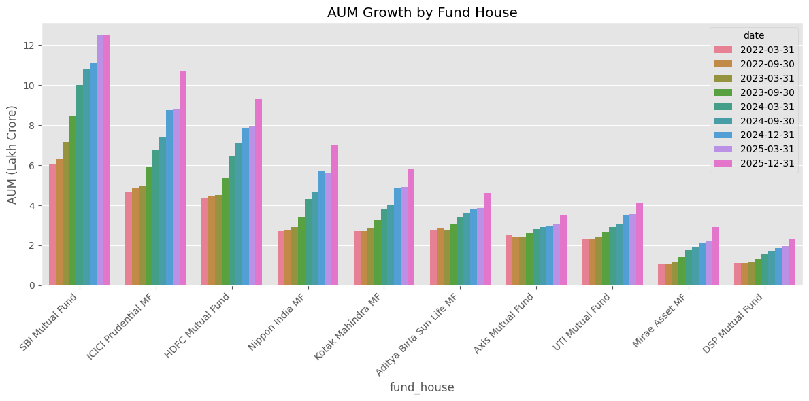
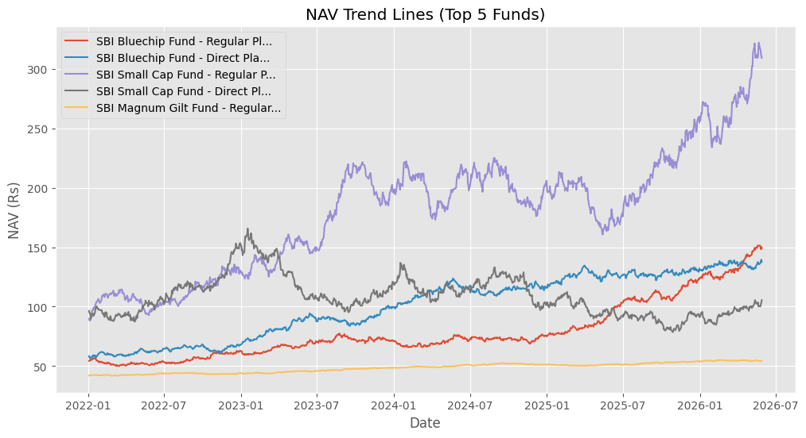
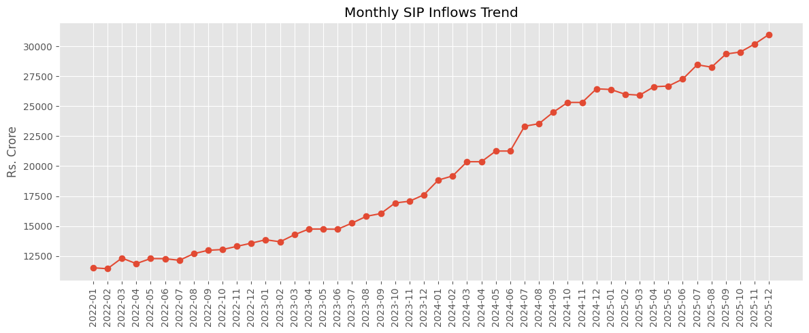
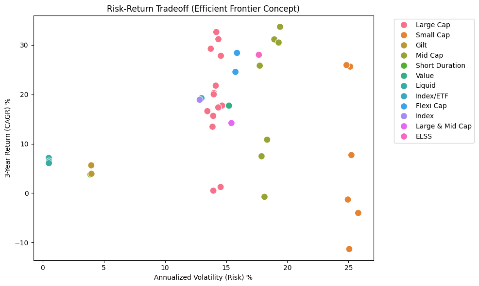
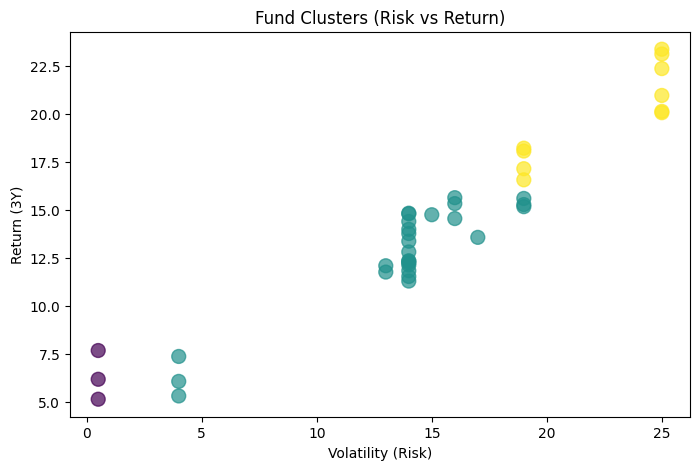
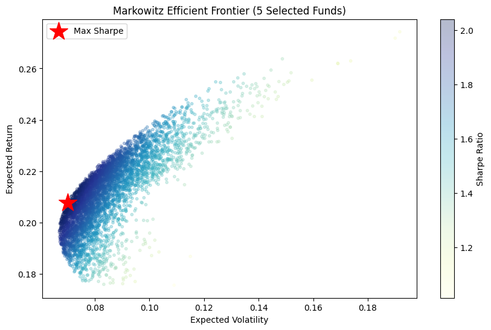
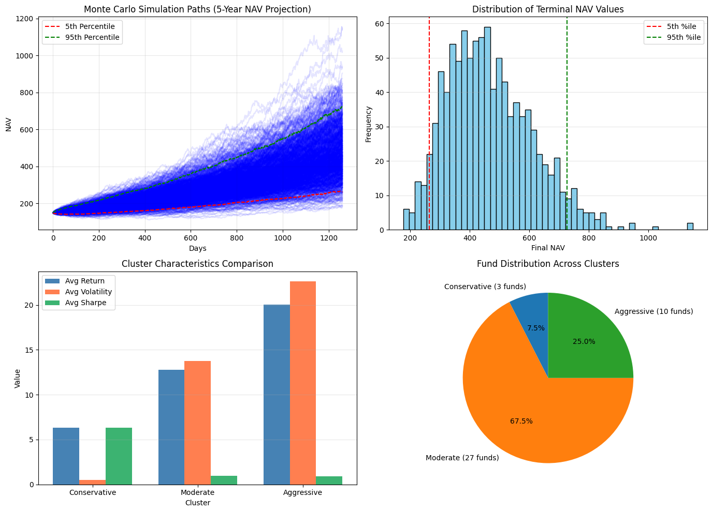

# Bluestock Mutual Fund Analytics Platform


Bluestock Mutual Fund Analytics is a full-stack data engineering and investment analytics project for Indian mutual funds. It turns fragmented CSV datasets into a cleaned warehouse, computes fund-level performance and risk metrics, and serves the results through notebooks, reports, SQL, and an interactive Streamlit dashboard.

The project currently covers 40 schemes across 10 AMCs, 46,000 NAV records from 2022-01-03 to 2026-05-29, 32,778 investor transactions, 322 portfolio holdings, 7 benchmark indices, and a latest industry AUM snapshot of 62.74 lakh crore.

## What It Does

| Layer | Feature | What is inside | Output |
|---|---|---|---|
| Data ingestion | Raw-to-processed CSV loading | 10 mutual fund datasets loaded and profiled through notebook checks | `data/processed/*.csv` |
| ETL pipeline | Validation, transformation, loading | NAV forward fill, daily returns, schema alignment, SQLite load | `scripts/etl_pipeline.py` |
| Warehouse | Star schema model | Fund, date, NAV, AUM, SIP, inflow, transaction, portfolio, and benchmark tables | `sql/schema.sql` |
| Metrics engine | Fund performance and risk | 1Y return, 3Y CAGR, Sharpe, Sortino, alpha, beta, drawdown, VaR, CVaR | `outputs/performance_metrics.csv` |
| Dashboard | Decision cockpit | Executive KPIs, fund comparison, risk analytics, recommendations, demographics, portfolio concentration | `streamlit_app.py` |
| Advanced analytics | ML and optimization | K-Means segmentation, Monte Carlo NAV simulation, Markowitz efficient frontier | `notebooks/05_advanced_analytics.ipynb` |
| Reporting | Business-ready summaries | Automated PDF, PPTX, and HTML weekly summary reports | `reports/` |
| Bonus utilities | Live and scheduled workflows | Live NAV fetch, email summary generation, cron setup helper | `scripts/` |

## Notebook Evidence

These charts are exported from the project notebooks and kept as README assets so the repository tells the analytical story without asking the reader to open Jupyter first.

| Market scale and flows | Fund behavior and risk |
|---|---|
|  |  |
|  |  |

| Advanced analytics | Portfolio optimization |
|---|---|
|  |  |
|  | Segmentation, simulation, and optimization extend the project beyond descriptive analytics into portfolio decision support. |

## Current Results Snapshot

| Signal | Current value |
|---|---:|
| Funds analyzed | 40 |
| Fund houses covered | 10 |
| Fund categories | 12 |
| NAV records | 46,000 |
| Benchmark records | 8,050 |
| Investor transactions | 32,778 |
| Portfolio holdings | 322 |
| Latest SIP inflow | 31,002 crore in 2025-12 |
| Latest total AUM snapshot | 62.74 lakh crore on 2025-12-31 |
| Average computed Sharpe ratio | 0.54 |
| Highest computed alpha | 31.51 percent |

Top 3 schemes by computed 3-year return in the latest metrics output:

| Rank | Scheme | 3Y return | Sharpe |
|---:|---|---:|---:|
| 1 | Axis Midcap Fund - Regular - Growth | 33.67 percent | 1.00 |
| 2 | Mirae Asset Large Cap Fund - Regular - Growth | 32.61 percent | 1.45 |
| 3 | ICICI Pru Bluechip Fund - Direct - Growth | 31.16 percent | 1.03 |

## Repository Map

```text
bluestock/
|-- assets/readme/                 # README banner and notebook chart exports
|-- dashboard/                     # Power BI dashboard specification
|-- data/processed/                # Cleaned mutual fund datasets
|-- notebooks/                     # Day-wise ingestion, cleaning, EDA, performance, ML
|-- outputs/                       # Computed metric outputs
|-- reports/                       # PDF, PPTX, and HTML reports
|-- scripts/                       # ETL, metrics, recommender, reporting, live NAV utilities
|-- sql/                           # Schema and analytical queries
|-- streamlit_app.py               # Streamlit analytics portal
|-- requirements.txt               # Python dependencies
`-- setup_venv.sh                  # Environment helper
```

## Run Locally

Create and activate an environment, then install dependencies:

```bash
python3 -m venv venv
source venv/bin/activate
pip install -r requirements.txt
```

Run the pipeline and compute the analytics layer:

```bash
python scripts/etl_pipeline.py
python scripts/compute_metrics.py
```

Launch the dashboard:

```bash
streamlit run streamlit_app.py
```

Generate final reporting artifacts:

```bash
python scripts/generate_report_slides.py
```

## Dashboard Pages

| Page | Purpose |
|---|---|
| Home | Project entry point and analytics overview |
| Executive Summary | AUM, SIP, NAV, and market-level KPIs |
| Fund Performance | Return, benchmark, and scheme comparison views |
| Risk Analytics | Volatility, Sharpe, Sortino, alpha, beta, VaR, CVaR, drawdown |
| Recommendation Center | Rule-based fund recommendations by investor profile |
| Investor Demographics | Transaction patterns by investor segment |
| Portfolio and Concentration | Holdings, sector exposure, and concentration checks |
| Simulations and Optimization | Monte Carlo and efficient-frontier analysis |

## Technical Stack

| Area | Tools |
|---|---|
| Data processing | Python, pandas, NumPy |
| Statistical analytics | SciPy, scikit-learn |
| Visualization | Matplotlib, Seaborn, Plotly |
| Data storage | SQLite, SQL star schema |
| Application | Streamlit |
| Reporting | ReportLab, python-pptx, HTML email templates |

## Notes for Reviewers

The repository is built to be read in the same order as the project workflow: ingestion notebook, cleaning notebook, EDA notebook, performance notebook, advanced analytics notebook, ETL scripts, dashboard, and reports. The README charts mirror that path and show the project moving from dataset validation to market trends, risk-return analytics, clustering, simulation, and optimization.
